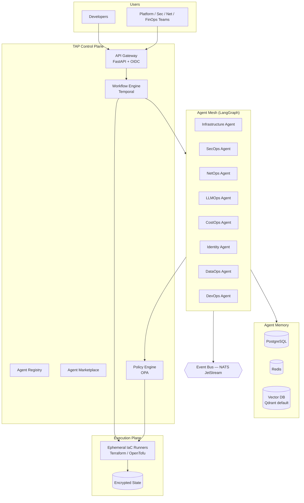

# Terraform Agent Platform (TAP)

**An Agentic Terraform Operating System** — provision, govern, secure, and optimize
infrastructure across AWS, Azure, GCP, Kubernetes, and AI platforms through
intelligent, human-governed agents.

TAP is a production-grade platform, not a proof of concept. It is designed to be
reused across traditional enterprises, startups, SaaS platforms, MSPs, and
agentic AI businesses — and to serve as the foundation of a commercial SaaS
offering that competes with Spacelift, Terraform Cloud, Scalr, and internal
developer platforms like Backstage, Port, and Humanitec.

---

## Why TAP

Existing IaC platforms automate *pipelines*. TAP automates *intent*:

| Capability | Terraform Cloud / Spacelift / Scalr | Backstage / Port / Humanitec | **TAP** |
|---|---|---|---|
| Plan / apply / drift | ✅ | ❌ | ✅ |
| Policy as code | ✅ (Sentinel / OPA) | partial | ✅ OPA-native, Sentinel adapter |
| Developer self-service | partial | ✅ | ✅ agent-driven |
| Autonomous remediation | ❌ | ❌ | ✅ governed agents |
| Multi-agent orchestration | ❌ | ❌ | ✅ LangGraph + Temporal |
| AI / LLMOps infrastructure | ❌ | ❌ | ✅ first-class modules |
| Agent marketplace | ❌ | plugin catalogs | ✅ |

## Architecture at a Glance



Full reference architecture: [`docs/architecture/ARCHITECTURE.md`](docs/architecture/ARCHITECTURE.md)
Decision records: [`docs/adr/`](docs/adr/)

## Repository Layout

```
terraform-agent-platform/
├── agents/            # Agent implementations (LangGraph graphs + tools)
│   ├── core/          #   Base agent framework, memory, comms, guardrails
│   ├── appops/        #   App lifecycle, env deployment, self-service
│   ├── devops/        #   CI/CD, GitOps, environment promotion
│   ├── secops/        #   Scanning (Checkov/tfsec/Trivy), OPA validation
│   ├── netops/        #   VPC/VPN/LB/DNS/routing
│   ├── dataops/       #   Snowflake, Databricks, Airflow, lakehouse
│   ├── llmops/        #   Bedrock/Azure OpenAI/Vertex, RAG, AI governance
│   ├── identity/      #   IAM, RBAC, federation, zero trust
│   └── costops/       #   FinOps, budgets, forecasting
├── platform/          # Control plane: API, registry, marketplace, workflow engine
├── sdk/               # Python SDK for building and publishing agents
├── plugins/           # Plugin interfaces (runners, policy engines, vector stores)
├── terraform/         # Reusable modules: aws/ azure/ gcp/ kubernetes/ ai/ shared/
├── governance/        # Policy-as-code framework (OPA bundles, Sentinel adapter)
├── compliance/        # SOC2 / ISO27001 / HIPAA / PCI / GDPR / NIST / CIS mappings
├── policies/          # Rego policies (terraform, kubernetes, cost, ai)
├── workflows/         # CI pipelines: GitHub Actions, GitLab CI, Azure DevOps
├── gitops/            # ArgoCD / Flux manifests for platform + workloads
├── observability/     # OTel collector, Prometheus rules, Grafana dashboards
├── examples/          # End-to-end scenarios per persona
├── scripts/           # Bootstrap, dev-env, release tooling
├── tests/             # Unit (pytest), policy (opa test), module (terratest)
└── docs/              # Architecture, ADRs, guides, SaaS + commercialization
```

## Quick Start (Development)

```bash
# 1. Bootstrap local stack (Postgres, Redis, NATS, Qdrant, Temporal, OPA)
./scripts/dev-up.sh

# 2. Install platform + SDK
pip install -e ./platform -e ./sdk

# 3. Run the control plane
tap-server --config platform/config/dev.yaml

# 4. Run your first governed plan
tap run plan --workspace demo --dir examples/aws-vpc-baseline
```

See [`docs/guides/developer-guide.md`](docs/guides/developer-guide.md).

## Core Concepts

- **Agent** — a LangGraph graph with a manifest (`agent.yaml`), typed tools,
  memory access, and policy guardrails. Discovered via the Agent Registry.
- **Workspace** — a unit of infrastructure state + variables + RBAC, bound to a
  tenant and environment.
- **Run** — a governed execution (plan/apply/destroy/drift/cost/compliance)
  flowing through the Temporal workflow engine with policy gates and optional
  human approval.
- **Policy Gate** — OPA evaluation at plan time; hard-fail, soft-fail
  (approval-required), or advisory.
- **Marketplace** — internal, community, and enterprise agents distributed as
  signed OCI artifacts.

## Governance & Security Posture

- Policy as code (OPA/Rego) on every run; Sentinel adapter for HCP migrators
- Security scanning: Checkov, tfsec, Trivy, Terrascan in CI and at plan time
- Compliance controls mapped to SOC2, ISO 27001, HIPAA, PCI-DSS, GDPR, NIST 800-53, CIS
- No static cloud credentials: OIDC federation to AWS/Azure/GCP
- Ephemeral runners, encrypted state (per-tenant KMS keys), full audit trail

## License

Apache 2.0 (core platform). See [`docs/adr/0007-licensing.md`](docs/adr/0007-licensing.md)
for the open-core / commercial strategy.

## Status

Foundational scaffold — architecture, module skeletons, policies, pipelines,
and SDK are in place for a platform engineering team to expand. See
[`docs/roadmap.md`](docs/roadmap.md).
