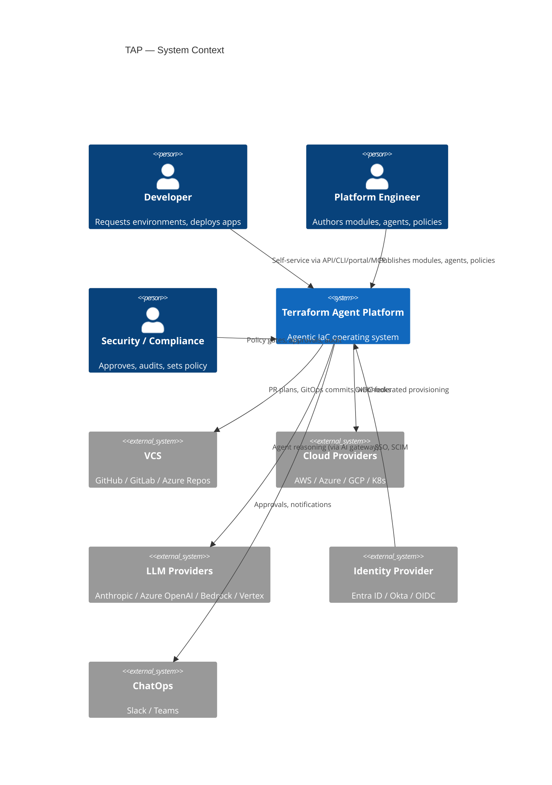
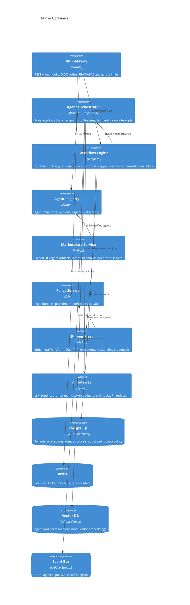
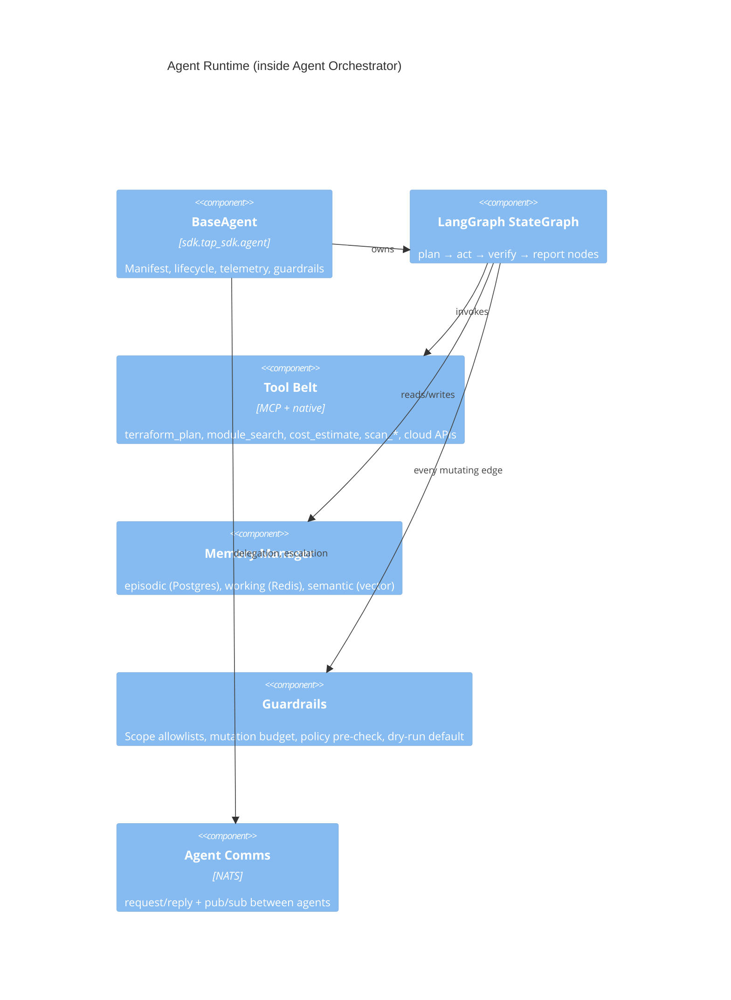
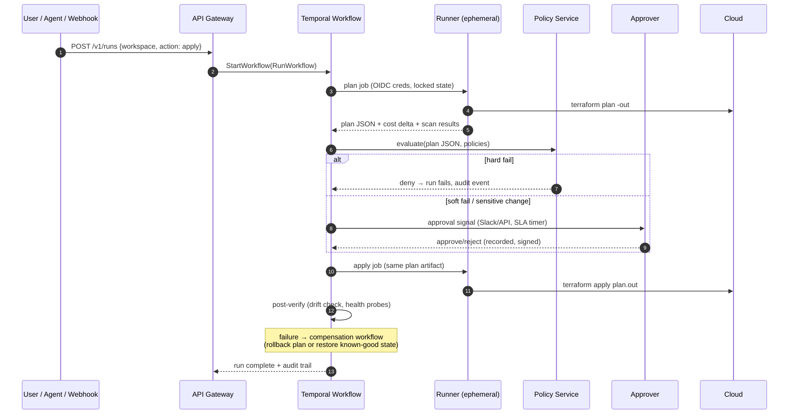
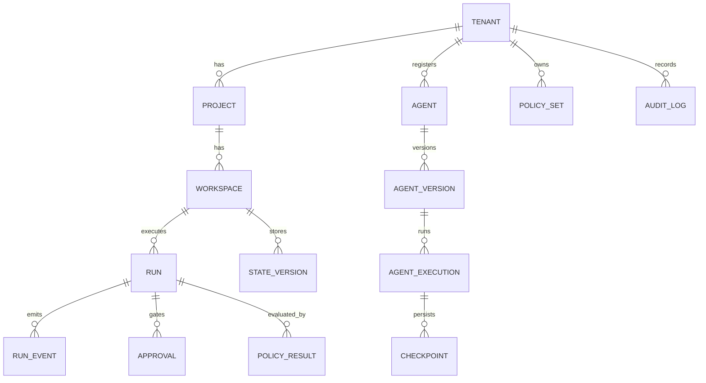

# TAP Reference Architecture

Status: v1.0 (foundational) · Owners: Platform Architecture Group
Related: [ADR index](../adr/README.md) · [Multi-tenant design](../saas/multi-tenant-design.md) · [Security guide](../guides/security-guide.md)

---

## 1. Research Summary — Why This Shape

TAP's architecture is the synthesis of what works (and fails) across the IaC,
platform engineering, and agent ecosystems:

| Category | Systems studied | What we adopted | What we rejected |
|---|---|---|---|
| IaC engines | Terraform, OpenTofu, Terragrunt, Pulumi, Crossplane | Terraform/OpenTofu dual runner behind one interface; Terragrunt-style DRY via generated backend/provider config | Pulumi-only (language lock-in); Crossplane-only (control-plane coupling to K8s, weak plan/preview semantics) |
| Workflow platforms | Spacelift, Env0, Scalr, Atlantis, Terraform Cloud | Spacelift's policy-first run lifecycle; Atlantis' PR-driven ergonomics; TFC workspace/run model as the baseline vocabulary | Atlantis' single-tenant statelessness; TFC's closed plugin surface |
| Platform engineering | Backstage, Humanitec, Port, Cortex | Port-style entity/blueprint catalog for the Agent Registry; Humanitec-style abstraction between dev intent and infra | Backstage's plugin monolith (high TCO, frontend-coupled) |
| GitOps | ArgoCD, FluxCD | ArgoCD for platform self-management; both supported for workload delivery | GitOps as the *only* interface (agents need imperative, governed runs too) |
| Policy | Sentinel, OPA, Kyverno, Falco | OPA/Rego as the native engine (CNCF-graduated, vendor-neutral, testable); Kyverno for K8s admission; Falco for runtime signals | Sentinel as core (proprietary, HCP-only) — kept as migration adapter |
| Agent frameworks | LangGraph, CrewAI, AutoGen, Semantic Kernel, OpenAI Agents, Claude Code, MCP | LangGraph (explicit state graphs, checkpointing, human-in-the-loop interrupts); MCP as the tool-exposure standard | CrewAI/AutoGen as core (conversation-centric, weak determinism guarantees for infra mutation) |

Key tradeoffs accepted:

1. **Temporal over a homegrown DAG engine.** Durable execution, replayable
   history, signals (human approval), and saga compensation (rollback) are
   exactly the semantics infra runs need. Cost: one more stateful dependency —
   mitigated by Temporal Cloud or the bundled self-hosted deployment.
2. **OPA over Sentinel.** Vendor neutrality and an enormous rule ecosystem beat
   HCP integration. A Sentinel adapter preserves migration paths.
3. **Python control plane.** The agent ecosystem (LangGraph, provider SDKs,
   ML tooling) is Python-first; FastAPI gives OpenAPI-native contracts. Runner
   images are language-agnostic (any OCI).
4. **NATS JetStream default bus.** Single-binary ops, subject-per-tenant
   isolation. Kafka adapter exists for enterprises with Kafka estates.

---

## 2. C4 — Level 1: System Context

## 3. C4 — Level 2: Containers

## 4. C4 — Level 3: Agent Runtime Components

## 5. Governed Run Lifecycle (Core Data Flow)

Invariants:
- Apply only ever executes a **previously evaluated plan artifact** (no TOCTOU).
- Every state transition emits `run.*` events and an immutable audit row.
- Runners are single-use pods; credentials are 15-minute OIDC tokens scoped to
  the workspace's cloud role.

## 6. Data Architecture

System of record: PostgreSQL with row-level security on `tenant_id`.
Full DDL: [`platform/db/schema.sql`](../../platform/db/schema.sql).

Core entities:

Memory tiers per agent: working (Redis, TTL), episodic (Postgres,
`agent_executions` + checkpoints), semantic (vector DB collections namespaced
`tenant:{id}:agent:{name}`).

## 7. API Design

OpenAPI 3.1 contract: [`platform/api/openapi.yaml`](../../platform/api/openapi.yaml).
Surface (v1): `/tenants /projects /workspaces /runs /agents /marketplace
/policies /approvals /modules /costs /audit`. Conventions: cursor pagination,
idempotency keys on POST, RFC 7807 problem+json errors, webhook + SSE event
streams. AuthN: OIDC bearer; AuthZ: RBAC roles × ABAC attributes (environment,
cost ceiling, resource class) evaluated in OPA.

## 8. Multi-Tenancy

Three isolation tiers (tenant-selectable, priced accordingly):

| Tier | Compute | Data | State | Target |
|---|---|---|---|---|
| Pooled | shared orchestrator + runners (namespaced) | Postgres RLS | shared bucket, per-tenant KMS key | SMB / community |
| Siloed runners | shared control plane, dedicated runner node pool | RLS + separate vector collections | dedicated bucket | regulated mid-market |
| Dedicated | per-tenant control plane (cell) | dedicated DB | dedicated | Fortune 500 / sovereignty |

Details: [`docs/saas/multi-tenant-design.md`](../saas/multi-tenant-design.md).

## 9. HA & DR

- Control plane: stateless API/orchestrator pods, HPA, multi-AZ; Temporal
  multi-replica with Postgres HA (Patroni or managed).
- RPO/RTO targets: state storage RPO ≈ 0 (versioned object store, cross-region
  replication); control plane RTO ≤ 30 min via GitOps re-hydration (ArgoCD
  app-of-apps in `gitops/platform/`).
- Terraform state: versioned, locked (Postgres advisory locks), continuous
  backup; broken-apply recovery = compensation workflow + state rollback to
  last `STATE_VERSION`.
- Event bus: JetStream R3 replication; consumers idempotent by `run_id+seq`.

## 10. AI / LLMOps Architecture

All agent LLM traffic flows through the **AI Gateway**: provider routing
(Anthropic, Azure OpenAI, Bedrock, Vertex, Mistral), prompt registry with
versioned templates, token/cost budgets per tenant and per agent, structured
output validation, red-team/eval hooks, and full trace capture to OTel. The
LLMOps Agent additionally *provisions* AI infrastructure via
[`terraform/ai/`](../../terraform/ai/) modules (model endpoints, vector DBs,
RAG stacks) — TAP both *uses* and *manages* AI infrastructure.

## 11. Observability

OTel SDK everywhere → OTel Collector → Prometheus (metrics), Loki (logs),
Tempo (traces). Golden signals per container + domain metrics: run duration,
plan→apply conversion, policy denial rate, drift count, agent token spend,
cost delta per run. Dashboards and alert rules: [`observability/`](../../observability/).

## 12. Security Architecture

- Zero static cloud credentials: workspace → cloud role via OIDC federation.
- Secrets: external KMS/Vault references only; never in state (state encrypted
  per-tenant anyway).
- Supply chain: agents and runner images signed (cosign), SBOM published,
  marketplace verification pipeline.
- Agent containment: guardrail layer enforces scope allowlists, mutation
  budgets, and mandatory policy pre-check before any mutating tool call;
  destroy actions always require human approval regardless of policy result.
- Full threat model: [`docs/guides/security-guide.md`](../guides/security-guide.md).
