# TAP Multi-Tenant Design

Status: v1.0 · Owners: Platform Architecture Group
Related: [ARCHITECTURE.md §8](../architecture/ARCHITECTURE.md) · [ADR-0009](../adr/0009-execution-security.md) · [SaaS deployment guide](saas-deployment-guide.md)

This document expands the three isolation tiers summarized in
[ARCHITECTURE.md §8](../architecture/ARCHITECTURE.md). Tiers are
tenant-selectable and priced accordingly; a tenant can move up-tier without
data migration drama because every tier uses the same logical model.

```mermaid
graph LR
    subgraph Pooled["Pooled (SMB / community)"]
        P_CP[Shared control plane]
        P_R[Shared runner pool<br/>namespaced Jobs]
        P_DB[(Postgres RLS)]
        P_S[(Shared bucket<br/>per-tenant KMS)]
    end
    subgraph Siloed["Siloed runners (regulated mid-market)"]
        S_CP[Shared control plane]
        S_R[Dedicated runner<br/>node pool]
        S_DB[(Postgres RLS +<br/>separate vector collections)]
        S_S[(Dedicated bucket)]
    end
    subgraph Dedicated["Dedicated cell (Fortune 500 / sovereignty)"]
        D_CP[Per-tenant control plane]
        D_R[Dedicated runners]
        D_DB[(Dedicated DB)]
        D_S[(Dedicated bucket + CMK)]
    end
    Pooled -->|upgrade| Siloed -->|upgrade| Dedicated
```



---

## 1. Data Isolation

**Postgres RLS.** Every tenant-scoped table carries `tenant_id`; RLS policies
compare it to the transaction-local `app.tenant_id` set by the API layer from
the authenticated principal (ADR-0008). Application DB roles cannot bypass
RLS; a missing tenant context yields zero rows, not all rows. The pattern per
table:

```sql
ALTER TABLE runs ENABLE ROW LEVEL SECURITY;
ALTER TABLE runs FORCE ROW LEVEL SECURITY;
CREATE POLICY tenant_isolation ON runs
  USING (tenant_id = current_setting('app.tenant_id')::uuid);
```

CI includes cross-tenant read attempts as failing tests. Dedicated tier
replaces RLS-in-shared-DB with a physically separate database per cell —
same schema, so tooling is identical.

**Per-tenant KMS.** State versions and sensitive blobs are envelope-encrypted
under a per-tenant KMS key before storage. Pooled tier: platform-managed keys,
one per tenant. Siloed and above: customer-managed keys (CMK) supported —
revoking the CMK renders the tenant's state cryptographically inert, which is
both a sovereignty feature and the backstop of offboarding.

**Memory tiers.** Redis keys and vector collections are namespaced
`tenant:{id}:agent:{name}` and derived from execution context, never from
agent input (ADR-0006). Siloed tier gets physically separate vector
collections; dedicated gets a separate Qdrant instance.

## 2. Compute Isolation

- **Namespaces (all tiers).** Every runner Job executes in a tenant-labeled
  namespace with ResourceQuota, LimitRange, restricted PodSecurity admission,
  and the hardened pod spec from ADR-0009.
- **Node pools (siloed).** Dedicated, tainted runner node pools per tenant:
  no co-residency with other tenants' runners, sized on peak concurrent runs.
  The control plane remains shared.
- **Cells (dedicated).** A full per-tenant stack — control plane, Temporal,
  NATS, DB, bucket — deployed as a cell ([deployment guide](saas-deployment-guide.md)).
  Cells share only the global routing layer and the artifact registry.
  Blast radius of any cell-level failure is one tenant.

## 3. Network Isolation

- Default-deny NetworkPolicy in every runner namespace. Egress allowlist per
  runner is generated at Job creation from the workspace's declared providers:
  the target cloud's API endpoints, the state storage endpoint, the policy
  service, and nothing else — no tenant-to-tenant path, no control-plane
  path, no arbitrary internet.
- Private endpoints for cloud APIs and state storage where available;
  TLS everywhere with platform-internal mTLS between control-plane services.
- Dedicated cells can sit on tenant-peered networks (PrivateLink/VNet peering)
  so runner egress never transits public internet.
- The event bus enforces subject-tree permissions per tenant account at the
  broker (ADR-0004) — network reachability to NATS does not grant data access.

## 4. Noisy-Neighbor Controls

Enforced *before* resources are committed, in the workflow engine and AI
gateway, so an abusive tenant queues rather than degrades others:

| Control | Mechanism | Default (pooled) |
|---|---|---|
| Concurrent runs | Temporal per-tenant semaphore before Job creation | 5 |
| Run quota | Sliding-window count per tenant per day | 200 |
| Runner resources | ResourceQuota/LimitRange per namespace | 2 vCPU / 4 GiB per Job |
| Agent token budget | AI gateway per-tenant + per-agent budgets; hard stop with graceful agent termination | plan-dependent |
| API rate limits | Redis counters at the gateway, per token | 60 rpm burst 120 |
| Event flow | Per-account JetStream limits (msgs/s, storage) | broker defaults |

Budgets emit `cost.*` events as they accrue, so metering, alerts ("80% of
token budget"), and billing share one stream. Quota exhaustion is a 429/queue,
never a silent drop; approaching-limit warnings surface in the portal.

## 5. Tenant Lifecycle

**Onboard.** Create tenant → provision KMS key, NATS account, vector
namespace, default policy set → tenant admin configures OIDC/SSO and cloud
trust (bootstrap modules in `terraform/` create the federation role) → first
workspace. Pooled onboarding is fully automated minutes-scale; dedicated-cell
onboarding is a GitOps PR that stamps a new cell.

**Offboard.** Ordered teardown with a mandatory export window: disable new
runs → final state/config export → delete runner namespace and node pools →
delete data under retention policy → revoke/schedule-delete KMS key (the
cryptographic backstop: even a missed blob is unreadable) → emit signed
deletion attestation for the tenant's compliance records.

**Export.** Self-service at any time, not just offboarding: state versions,
workspace/variable config (secrets as references, never values), run history
and audit log (JSONL), policy sets, and agent memory collections. Export is
the anti-lock-in guarantee the [commercialization plan](commercialization.md)
sells against incumbents — it has to actually work, so it is exercised in CI
against a seeded tenant.
