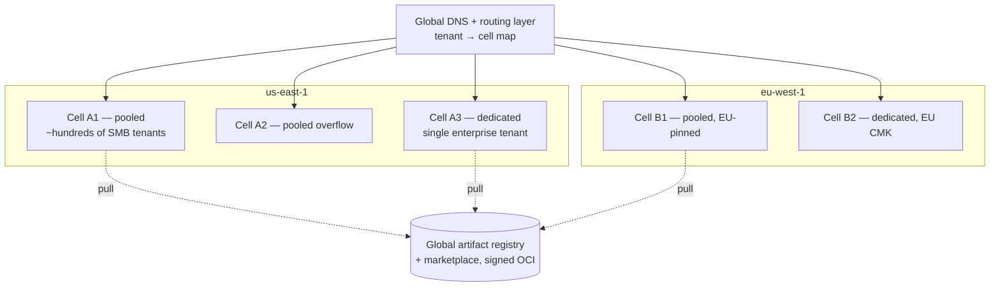

# TAP SaaS Deployment Guide

Audience: the team operating TAP-as-a-service.
Related: [Multi-tenant design](multi-tenant-design.md) · [Operations guide](../guides/operations-guide.md) · [ARCHITECTURE.md §9](../architecture/ARCHITECTURE.md)

TAP's SaaS runs on TAP: the reference deployment is provisioned by the
platform's own modules in `terraform/aws/` and `terraform/kubernetes/`, and
managed as TAP workspaces in a bootstrap tenant. Dogfooding is the first
production test of every module we ship.

---

## 1. Reference Deployment (EKS)

Per region, the platform footprint is:

- **EKS** — control-plane node group (tainted, on-demand), runner node groups
  (autoscaled, mixed on-demand/spot for plan jobs, on-demand for applies),
  per-tenant pools for siloed-tier tenants.
- **Aurora PostgreSQL** — system of record + Temporal persistence (separate
  clusters at scale), multi-AZ, PITR.
- **ElastiCache Redis**, **Qdrant** (on EKS with EBS, snapshot to S3),
  **NATS JetStream** (3 replicas across AZs).
- **S3** — versioned state buckets, cross-region replication; **KMS** —
  per-tenant keys; **IAM OIDC provider** — runner federation (ADR-0009).
- Ingress: ALB → gateway; all cross-service traffic in-VPC; runner egress via
  per-namespace NetworkPolicy ([multi-tenant design §3](multi-tenant-design.md)).
- Temporal: self-hosted on EKS or Temporal Cloud per cell — the cell manifest
  flips one value (ADR-0003).

Everything above is expressed as TAP workspaces over `terraform/` modules;
platform changes flow through TAP's own governed-run lifecycle, policy gates
included. The bootstrap path (first cell, before TAP exists to manage itself)
is `scripts/` + plain `tofu apply`, documented in the runbook, then imported.

## 2. Cell Architecture

A **cell** is the unit of blast radius, capacity, and tenancy: one complete
TAP stack (control plane, Temporal, NATS, DB, buckets) serving a bounded set
of tenants.

Rules:

- Tenant → cell assignment is static (routing layer holds the map); tenants
  never span cells. Cross-cell traffic does not exist except registry pulls
  and control-plane telemetry to the central observability account.
- Pooled cells cap at a fixed tenant/run envelope; growth adds cells, not
  bigger cells. Dedicated tier = one tenant per cell
  ([multi-tenant design](multi-tenant-design.md)).
- Cells are stamped from one versioned manifest (GitOps app-of-apps +
  `terraform/` modules). Cell upgrades roll wave-by-wave: staging cell →
  canary pooled cell → remaining pooled → dedicated (which pin upgrade
  windows contractually).
- A cell-wide failure strands only that cell's tenants; the DR story per cell
  is the standard one in the [operations guide](../guides/operations-guide.md).

## 3. Region Expansion

Opening a region is a stamped, boring procedure:

1. Land the regional foundation (accounts/VPC/EKS/KMS) from `terraform/aws/`
   via a TAP workspace in the bootstrap tenant.
2. Stamp the first pooled cell from the cell manifest; run the cell
   conformance suite (seeded tenant, end-to-end governed run, restore drill).
3. Register the cell with the routing layer; open for tenant placement.
4. Data residency: a tenant's region pin is honored for *all* tenant data —
   DB, state, vector, event streams, and LLM routing (the AI gateway pins
   provider endpoints to compatible regions). Residency is a placement
   property, not a feature flag.

Target: new region in under two weeks, dominated by cloud-account and
compliance lead time, not engineering.

## 4. Billing and Metering

Metering is event-sourced from the **`cost.*` subject tree** (ADR-0004) —
the same stream tenants see for their own cost visibility:

| Event | Emitted by | Drives |
|---|---|---|
| `cost.run_metered` | Workflow engine at run completion (duration, runner size, engine) | Per-run charges |
| `cost.tokens_metered` | AI gateway per agent execution (provider, model, tokens in/out) | Agent-token charges |
| `cost.workspace_active` | Control plane, daily | Per-workspace subscription |
| `cost.storage_sampled` | State/vector storage sampler, daily | Storage overage |

The billing pipeline (enterprise repo, per ADR-0007) consumes these via a
durable JetStream consumer, aggregates to rating records, and reconciles
monthly against a full stream replay — replayability is why metering lives on
the bus. Invariants: metering events are idempotent (`run_id + seq`), billing
never reads production DBs directly, and a dropped consumer loses no revenue
(replay from stream).

## 5. Status Page and SLA Tiers

Public status page (status.tap-platform.dev) is fed by the same SLO probes the
on-call uses ([operations guide §6](../guides/operations-guide.md)) — synthetic
governed runs per cell, per region, so the page reflects tenant experience,
not component health. Components reported: API, run execution, approvals,
marketplace, per region.

| Tier | Availability SLA | Support | Maintenance |
|---|---|---|---|
| Community (OSS/self-host) | — | Community | — |
| Cloud Standard (pooled) | 99.5% | Business hours, 8h P1 response | Rolling, unannounced |
| Cloud Pro (pooled/siloed) | 99.9% | 24×7 P1, 2h response | Announced windows |
| Enterprise (dedicated cell) | 99.9%+ custom | 24×7, 30min P1, named TAM | Contractual windows, tenant-approved upgrades |

SLA credits compute from status-page incident records; the measurement
methodology (per-cell synthetic probes, 1-minute resolution) is published so
enterprises can verify independently.
